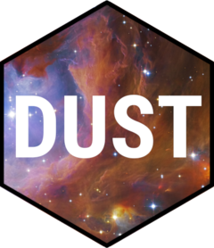

# dust 

<!-- badges: start -->
[](https://www.repostatus.org/#wip)
[](https://github.com/mrc-ide/dust/actions)
[](https://buildkite.com/mrc-ide/dust)
[](https://www.codefactor.io/repository/github/mrc-ide/dust)
[](https://codecov.io/github/mrc-ide/dust?branch=master)
<!-- badges: end -->

Stochastic models appear in many domains as they are easy to write out, but hard to analyse without running many realisations of the process. `dust` provides an engine for running stochastic models, taking care of many bookkeeping details such as:

* Running stochastic models in parallel on multi-core machines
* Running models massively in parallel on GPU without writing any low-level code
* Reducing output by filtering over steps or intermediate outputs
* Providing useful verbs for working with stochastic models (for initialisation, state setting, parameter updating, and inspection)
* Combining multiple realisations due to stochastic variability and due to different parameter sets

## Get started

Two vignettes provide an overview of the package, depending on your tastes:

* `vignette("design")` describes the problems `dust` tries to solve ([read on package website](https://mrc-ide.github.io/dust/articles/design.html))
* `vignette("dust")` describes `dust` by example, showing two simple models and the methods that can drive them ([read on package website](https://mrc-ide.github.io/dust/articles/dust.html))

There are further vignettes describing details:

* `vignette("multi")` on simulating multiple parameter sets at once
* `vignette("data")` on running a bootstrap particle filter
* `vignette("gpu")` on creating and running models on GPUs

And several on the random number generator, around which dust is built:

* `vignette("rng")` on the parallel random number generator used
* `vignette("rng_algorithms")` on the details of algorithms used to sample from some distributions
* `vignette("rng_package")` on using the generators from other packages

The C++ API is documented in a separate [set of documentation](cpp)

You can also read our open access paper describing `dust` and some related tools that use it:

> [FitzJohn, Knock, Whittles, Perez-Guizman, Bhatia, Guntoro, Watson, Whittaker, Ferguson, Cori, Baguelin, Lees 2021: Reproducible parallel inference and simulation of stochastic state space models using odin, dust, and mcstate, Wellcome Open Research 5, 288](https://wellcomeopenresearch.org/articles/5-288/v2)

## Higher-level

The `dust` package, while designed to be user-friendly, is lower-level than many users need. The [`odin.dust`](https://mrc-ide.github.io/odin.dust/) package provides a way of compiling stochastic [`odin`](https://mrc-ide.github.io/odin/) models to work with `dust`.  For example, to create a parallel epidemiological model, one might write simply:

```r
sir <- odin.dust::odin_dust({
  update(S) <- S - n_SI
  update(I) <- I + n_SI - n_IR
  update(R) <- R + n_IR

  n_IR <- rbinom(I, 1 - exp(-beta * I / (S + I + R)))
  n_SI <- rbinom(S, 1 - exp(-gamma))

  initial(S) <- S_ini
  initial(I) <- I_ini
  initial(R) <- 0

  S_ini <- user(1000)
  I_ini <- user(10)
  beta <- user(0.2)
  gamma <- user(0.1)
})
```

## Use-cases

We use `dust` to power several epidemiological models. Public examples include:

* [`sircovid`](https://mrc-ide.github.io/sircovid/) - a large model (over 15k states) of COVID-19 in the UK
* [`gonovaxdust`](https://mrc-ide.github.io/gonovaxdust/) - a model of gonorrhoea infection with vaccination

## Installation

Please install from our [r-universe](https://mrc-ide.r-universe.dev/):

```
install.packages(
  "dust",
  repos = c("https://mrc-ide.r-universe.dev", "https://cloud.r-project.org"))
```

If you prefer, you can install from GitHub with remotes:

```
remotes::install_github("mrc-ide/dust")
```

You will need a compiler to install dependencies for the package, and to build any models with dust.  `dust` uses `pkgbuild` to build its shared libraries so use `pkgbuild::check_build_tools()` to see if your system is ok to use.

## License

MIT © Imperial College of Science, Technology and Medicine
